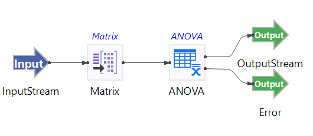

# ANOVA Operator Sample

## Introduction
This sample demonstrates the use of the TIBCO StreamBase&reg; ANOVA operator.  The ANOVA operator takes a list of data tuples as input (typically generated by the Matrix Operator) and produces the ANOVA results including the corresponding F statistic, p-value, as well as the mean, standard deviation, valid n for each group.  The ANOVA or analysis of variance is a generalization of the two sample t-test which allows one to test for equality of means across k independent groups where k is greater than or equal 2.

## Running This Sample in StreamBase Studio

1. In the Package Explorer view, double-click to open the sample_anova application. Make sure the application is the currently active tab in the EventFlow Editor.
2. Click the Run button. This opens the SB Test/Debug perspective and starts the application.
3. Click on the "Feed Simulations" tab and click on the Anova.sbfs to start feeding the data.
4. The Anova operater starts reading from "SEPALLEN" and "IRISTYPE" columns of irisdat.csv, testing the differences between sepal length among the different Iris Flower types and sending tuples downstream. 
5. When done, press F9 or click the Stop Running Application button.

## Importing This Sample into StreamBase Studio

In StreamBase Studio, import this sample with the following steps:

- From the top menu, select File → Load StreamBase Sample.
- In the search field, type anova to narrow the list of samples.
- Select anova from the StreamBase Standard Adapters category.
- Click OK.

StreamBase Studio creates a single project containing the sample files.