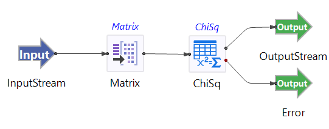

# Chi-square Test Operator Sample

## Introduction

This sample demonstrates the use of the TIBCO StreamBase&reg; Chi-Square operator. The Chi-Square operator can be used to test if one or more pair of discrete/categorical variables are statistically independent or not.  Additionally, the operator computes the Cramer's V  value which is a statistical measure of association bounded in the interval [0, 1] with values closer to 0 indicating independence and 1 indicating greater dependence or association. The two-way crosstabulation for each pair of variables including row, column, and total percentages is also available upon request.

The provided StreamBase module uses the randomly generated data set consisting of variables/fields X, Y, and Z which all have values ranging from 1-4. In this sample, the Matrix Operator is used to create a sliding window which keeps collecting 100 rows of data and emits the results every collected 100 rows . The Chi-square operator takes data lists as inputs and tests the null hypothesis that X, Y, and Z are independent.

## Running This Sample in StreamBase Studio

1. In the Package Explorer view, double-click to open the sample_ChiSquare application. Make sure the application is the currently active tab in the EventFlow Editor.
2. Click the  Run button. This opens the SB Test/Debug perspective and starts the application.
3. Click on the "Feed Simulations" tab and click on the ChiSquare.sbfs to start feeding the data.
4. The Chi-square operater starts streaming randomly generated data which has X, Y, and Z column. It will test the independence between X, Y, and Z variables and send results downstream. 
5. When done, press F9 or click the  Stop Running Application button.

## Importing This Sample into StreamBase Studio

In StreamBase Studio, import this sample with the following steps:

- From the top menu, select File → Load StreamBase Sample.
- In the search field, type ChiSquare to narrow the list of samples.
- Select ChiSq from the StreamBase Standard Adapters category.
- Click OK.

StreamBase Studio creates a single project containing the sample files.