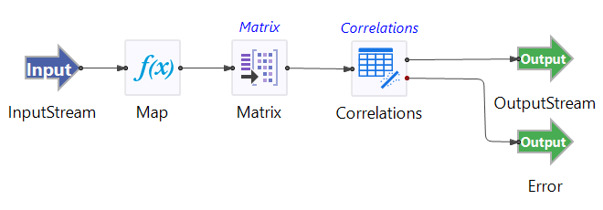

# Correlations Operator Sample

## Introduction

This sample demonstrates the use of the TIBCO StreamBase&reg; Correlations operator.  

The provided StreamBase module uses randomly generated data with three variables as inputs.  The data has been simulated such that the correlation between variables X1 and X3 evolve over time from a strong positive correlation to a strong negative correlation.  The matrix operator is used to emit data as a sliding window with 100 observations in each window.

## Running This Sample in StreamBase Studio

1. In the Package Explorer view, double-click to open the sample_correlation application. Make sure the application is the currently active tab in the EventFlow Editor.
2. Click the  Run button. This opens the SB Test/Debug perspective and starts the application.
3. Click on the "Feed Simulations" tab and click on the Correlation.sbfs to start feeding the data.
4. The Correlations operator starts taking data from the feed simulation, testing the correlations between X1, X2 and X3.
5. When done, press F9 or click the  Stop Running Application button.

## Importing This Sample into StreamBase Studio

In StreamBase Studio, import this sample with the following steps:
 
- From the top menu, select File → Load StreamBase Sample.
- In the search field, type correlations to narrow the list of samples.
- Select correlations from the StreamBase Standard Adapters category.
- Click OK.

StreamBase Studio creates a single project containing the sample files.