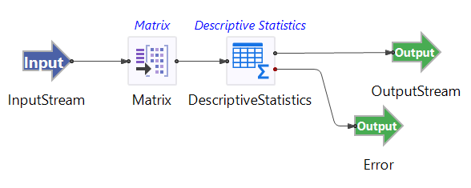

# Descriptive Statistics Operator Sample

## Introduction

This sample demonstrates the use of the TIBCO StreamBase&reg; Descriptive Statistics operator. 

The provided StreamBase module uses simulated data with four variables whose moments vary and evolve over time.   This example illustrates how the Descriptive Statistics operator coupled with the Matrix operator can allow you to easily monitor the trajectory of the sample moments over time allowing you to gain insight into possible shifts and drifts in the underlying data distributions. 

## Running This Sample in StreamBase Studio

1. In the Package Explorer view, double-click to open the sample_descriptivestatistics application. Make sure the application is the currently active tab in the EventFlow Editor.
2. Click the  Run button. This opens the SB Test/Debug perspective and starts the application.
3. Click on the "Feed Simulations" tab and click on the Descriptivestatistics.sbfs to start feeding the data.
4. The Descriptive Statistic operator starts taking data from the feed simulation and emitting the results after 50 rows collected.
5. When done, press F9 or click the  Stop Running Application button.

## Importing This Sample into StreamBase Studio

In StreamBase Studio, import this sample with the following steps:

- From the top menu, select File → Load StreamBase Sample.
- In the search field, type descriptivestatistic to narrow the list of samples.
- Select descriptivestatistic from the StreamBase Standard Adapters category.
- Click OK.

StreamBase Studio creates a single project containing the sample files.