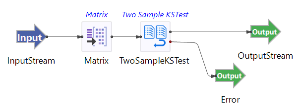

# Kolmogorov-Smirnov Two Sample Test Operator

## Introduction

This sample demonstrates the use of the TIBCO StreamBase&reg; Two Sample KS Test operator. The Two Sample KS Test Operator can be used to test whether or not two independent data distributions are equal or not.  This test looks for any differences in the distributions and is not just testing  whether or not the means differ as in the two sample t-test.  The KS test is nonparametric in that no underlying distributional assumptions are made, e.g. normality.

The provided StreamBase module uses the randomly generated data set including column X (response) and Y (code name A for Group 1 and code name B for Group 2). X is generated with uniform distribution ranging from 1 to 100. Y is generated as value A or B with the same weight. The data set is fed into the Matrix operator to collect and emit every 100 rows of data.  The Kolmogorow Two Sample Test operator takes the collected data and options (from proposed schema) as inputs.

## Running This Sample in StreamBase Studio

1. In the Package Explorer view, double-click to open the sample_kstest application. Make sure the application is the currently active tab in the EventFlow Editor.
2. Click the  Run button. This opens the SB Test/Debug perspective and starts the application.
3. Click on the "Feed Simulations" tab and click on the KSTest.sbfs to start feeding the data.
4. The Kolmogorow Two Sample Test operator starts taking data from the feed simulation and emitting the results after 100 rows collected.
5. When done, press F9 or click the  Stop Running Application button.

## Importing This Sample into StreamBase Studio

In StreamBase Studio, import this sample with the following steps:

- From the top menu, select File → Load StreamBase Sample.
- In the search field, type kstest to narrow the list of samples.
- Select kstest from the StreamBase Standard Adapters category.
- Click OK.

StreamBase Studio creates a single project containing the sample files.