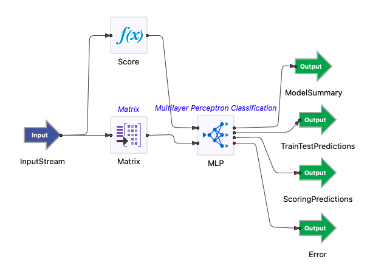

# Predictive Modeling Sample: Multilayer Perceptron Classification

## Introduction

This sample demonstrates the use of the TIBCO StreamBase&reg; Multilayer Perceptron Classification operator.

The provided StreamBase modules for these operators uses the IRIS Flower data - irisdat.csv.  SEPALLEN, SEPALLWID, PETALLEN, PETALWID features are selected as predictors. IRISTYPE is selected as response.  The data is fed into the Matrix operator to collect and emit every 150 rows of data.  These operator takes the collected data  and options (from proposed schema) as inputs.

## Running This Sample in StreamBase Studio

1. In the Package Explorer view, double-click to open the mlpclassification application. Make sure the application is the currently active tab in the EventFlow Editor.
2. Click the  Run button. This opens the SB Test/Debug perspective and starts the application.
3. Click on the "Feed Simulations" tab and click on the mlpclassification.sbfs to start feeding the data.
4. These operator starts taking data from the feed simulation and emitting the results after 150 rows collected.
5. When done, press F9 or click the  Stop Running Application button.

## Importing This Sample into StreamBase Studio

In StreamBase Studio, import this sample with the following steps:

- From the top menu, select File → Load StreamBase Sample.
- In the search field, type mlpclassification to narrow the list of samples.
- Select mlpclassification from the StreamBase Standard Adapters category.
- Click OK.

StreamBase Studio creates a single project containing the sample files.