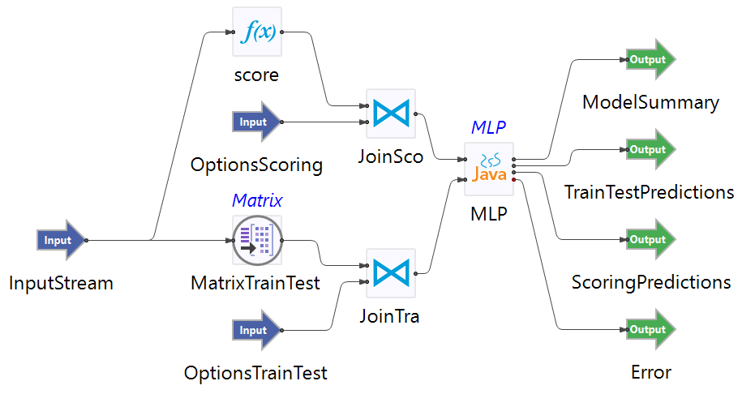

# Predictive Modeling Sample: Multilayer Perceptron Regression

## Introduction

This sample demonstrates the use of the TIBCO StreamBase&reg; Multilayer Perceptron Regression operator.

The provided StreamBase module uses the Boston Housing 2 data - BostonHousing2.csv. ValueofOccupiedHomes is selected as response.  The rest is selected as predictors. The data is fed into the Matrix operator to collect and emit every 300 rows of data.  The operator takes the collected data  and options (from proposed schema) as inputs.

## Running This Sample in StreamBase Studio

1. In the Package Explorer view, double-click to open the mlpregression application. Make sure the application is the currently active tab in the EventFlow Editor.
2. Click the  Run button. This opens the SB Test/Debug perspective and starts the application.
3. Click on the "Feed Simulations" tab and click on the mlpregression.sbfs to start feeding the data.
4. These operator starts taking data from the feed simulation and emitting the results after 300 rows collected.
5. When done, press F9 or click the  Stop Running Application button.

## Importing This Sample into StreamBase Studio

In StreamBase Studio, import this sample with the following steps:

- From the top menu, select File → Load StreamBase Sample.
- In the search field, type mlpregression to narrow the list of samples.
- Select mlpregression from the StreamBase Standard Adapters category.
- Click OK.

StreamBase Studio creates a single project containing the sample files.