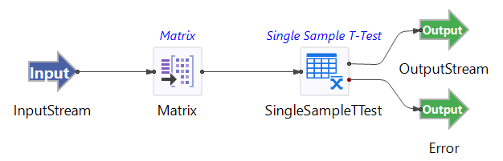

# Single Sample T-Test Operator

## Introduction

This sample demonstrates the use of the TIBCO StreamBase&reg; Single Simple T-test operator. 

The provided StreamBase module uses the randomly generated data set including column Var1 and Var2. Var1 is generated with uniform distribution ranging from 0 to 100 with mean value = 50. Var2 is generated with uniform distribution ranging from 0 to 60 with mean 30. The data set is fed into the Matrix operator to collect and emit every 100 rows of data.  

## Running This Sample in StreamBase Studio

1. In the Package Explorer view, double-click to open the sample_singlesimplettest application. Make sure the application is the currently active tab in the EventFlow Editor.
2. Click the  Run button. This opens the SB Test/Debug perspective and starts the application.
3. Click on the "Feed Simulations" tab and click on the singlesimplettest.sbfs to start feeding the data.
4. The Single Simple T-test operator starts taking data from the feed simulation and emitting the results after 100 rows collected.
5. When done, press F9 or click the  Stop Running Application button.

## Importing This Sample into StreamBase Studio

In StreamBase Studio, import this sample with the following steps:

- From the top menu, select File → Load StreamBase Sample.
- In the search field, type singlesimplettest to narrow the list of samples.
- Select singlesimplettest from the StreamBase Standard Adapters category.
- Click OK.

StreamBase Studio creates a single project containing the sample files.