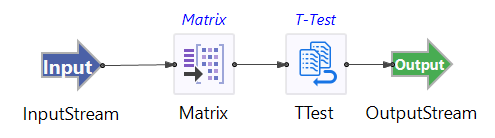

# Two Sample T-test Sample

## Introduction

This sample demonstrates the use of the TIBCO StreamBase&reg; Independent Two Sample T-Test operator.   The Two Sample T-Test operators allows you to test whether or not one or more pairs of variables has equal means.   

The Two Sample T-Test Operator coupled with the Matrix operator allows you to determine whether not two groups have the mean over time.  For this sample, the provided StreamBase module uses simulated data from a multivariate normal distribution of four variables whose means are drifting over time.   The data is sent to a matrix operator where the data is partitioned into tumbling windows of size 100.

## Running This Sample in StreamBase Studio

1. In the Package Explorer view, double-click to open the sample_ttest application. Make sure the application is the currently active tab in the EventFlow Editor.
2. Click the  Run button. This opens the SB Test/Debug perspective and starts the application.
3. Click on the "Feed Simulations" tab and click on the TTest.sbfs to start feeding the data.
4. The two sample T-test operator starts taking data from the feed simulation and emitting the results after 100 rows collected.
5. When done, press F9 or click the  Stop Running Application button.

## Importing This Sample into StreamBase Studio

In StreamBase Studio, import this sample with the following steps:

- From the top menu, select File → Load StreamBase Sample.
- In the search field, type ttest to narrow the list of samples.
- Select ttest to from the StreamBase Standard Adapters category.
- Click OK.

StreamBase Studio creates a single project containing the sample files.