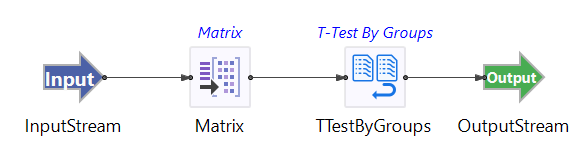

# Two Sample T-Test by Groups Operator

## Introduction

This sample demonstrates the use of the TIBCO StreamBase&reg; Two Sample T-Test by Groups operator.   The Two Sample T-Test by Groups Operator allows you to test whether or not one two independent groups measured on a continuous variable have equal means or not.

The Two Sample T-Test by Groups Operator coupled with the Matrix operator allows you to determine whether not two independent groups have the mean over time. The provided StreamBase module uses the randomly generated data set with two groups A and B measured on a single variable 'x'.  The data set is fed into the Matrix operator to collect and emit every 200 rows of data. 

## Running This Sample in StreamBase Studio

1. In the Package Explorer view, double-click to open the sample_ttestbygroups application. Make sure the application is the currently active tab in the EventFlow Editor.
2. Click the  Run button. This opens the SB Test/Debug perspective and starts the application.
3. Click on the "Feed Simulations" tab and click on the TTestByGroups.sbfs to start feeding the data.
4. The Independent Two Sample T-test operator starts taking data from the feed simulation and emitting the results after 100 rows collected.
5. When done, press F9 or click the  Stop Running Application button.

## Importing This Sample into StreamBase Studio

In StreamBase Studio, import this sample with the following steps:

- From the top menu, select File → Load StreamBase Sample.
- In the search field, type ttestbygroups to narrow the list of samples.
- Select ttestbygroups to from the StreamBase Standard Adapters category.
- Click OK.

StreamBase Studio creates a single project containing the sample files.